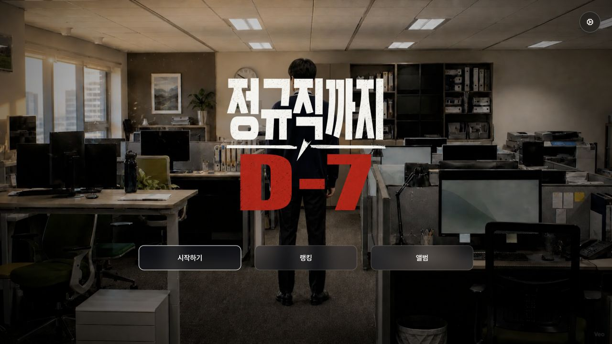
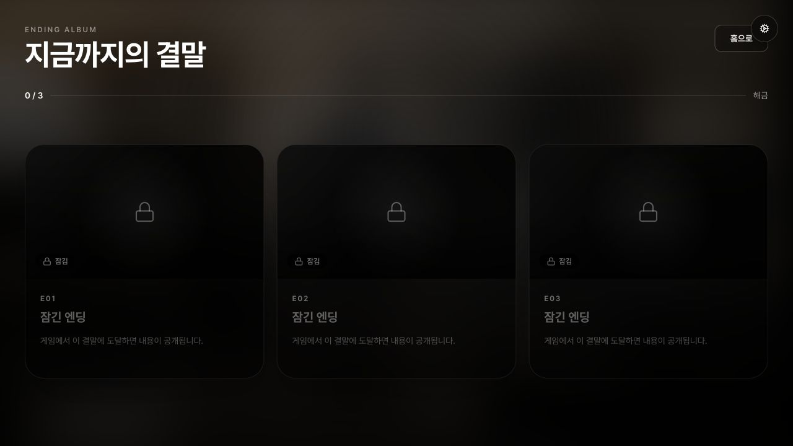

<p align="center">
  
</p>

<p align="center">
  선택이 미래를 바꾼다.<br />
  7일간의 인턴 생활을 영상으로 플레이하는 인터랙티브 오피스 드라마.
</p>



## 게임 소개

정규직 전환 결과 발표를 일주일 앞둔 김인턴.
월요일의 석연치 않은 업무 지시부터 금요일의 최종 면담까지, 매일 조직과
자신 사이에서 선택해야 합니다.

선택은 그 자리에서 끝나지 않습니다. 동료들은 김인턴의 행동을 기억하고,
나흘 동안 쌓인 결정은 서로 다른 세 가지 결말로 이어집니다.

## 주요 화면

### 시네마틱 스토리

8초 단위의 AI 영상, 대사 자막, 내레이션과 배경음이 하나의 장면처럼
이어집니다. 영상 재생과 일시정지, 건너뛰기, 자막 크기와 음량을 플레이
중에도 조절할 수 있습니다.


### 선택과 기억

분기점에서는 김인턴의 속마음과 두 가지 행동이 함께 나타납니다. 선택
결과는 짧은 피드백으로 남고, 이후 결말 판정에 반영됩니다.


### 엔딩 앨범

도달한 엔딩은 브라우저에 저장됩니다. 해금 전에는 엔딩 카드가
가려지고, 달성한 결말만 앨범에서 다시 볼 수 있습니다.



## 플레이 흐름

```text
프롤로그
  ↓
월요일 ─ 화요일 ─ 수요일 ─ 목요일
  ↓          매일 두 가지 선택
금요일 최종 면담
  ↓
E01 정규직이라는 족쇄
E02 회사 사정이라는 핑계
E03 김인턴의 거절
```

## 구현 기능

- 두 개의 비디오 레이어를 교차 사용하는 끊김 없는 장면 전환
- 챕터별 인트로와 월요일부터 금요일까지 이어지는 선택형 스토리
- JSON 기반 화자·대사·타임코드 자막
- 게임 진행, 선택지, 홈 화면별 BGM과 효과음
- 전체 음량, 배경음, 효과음, 자막 표시와 크기 설정
- 최초 방문 사운드 사용 여부 확인 및 설정 저장
- 선택 결과 피드백과 세 가지 엔딩 판정
- `localStorage` 기반 엔딩 해금 및 앨범
- 모바일 화면에서 전체 영상을 유지하는 레터박스 처리
- Open Graph, favicon, sitemap, robots, JSON-LD
- UI 컴포넌트와 주요 화면을 확인할 수 있는 Storybook

## 기술 구성

| 영역 | 기술 |
| --- | --- |
| Framework | Next.js 16 App Router |
| UI | React 19, TypeScript, Tailwind CSS 4 |
| Components | Base UI 기반 게임 UI 시스템 |
| Typography | Pretendard Variable |
| Documentation | Storybook 10 |
| Package manager | pnpm 11 |

## 시작하기

Node.js 20 이상과 pnpm이 필요합니다.

```bash
corepack enable
pnpm install
pnpm dev
```

개발 서버는 기본적으로 `http://localhost:3000`에서 실행됩니다.

### 영상 파일

운영 영상은 Cloudflare R2의 전용 미디어 도메인에서 제공합니다.

```text
https://media.example.com/day-7-videos/<filename>
```

실제로 참조되는 파일명은
[`src/data/game.ts`](./src/data/game.ts)에서 확인할 수 있습니다.
영상 주소는 [`src/lib/video.ts`](./src/lib/video.ts)의 공통 함수를 통해
생성됩니다. 실행 전에 미디어 경로를 환경 변수로 지정해야 합니다.

```bash
NEXT_PUBLIC_VIDEO_BASE_URL=https://media.example.com/day-7-videos
```

저장소에는 기본 영상 주소가 포함되지 않습니다. 환경 변수가 없거나
개별 영상을 불러오지 못하면 `동영상 재생에 문제가 생겼습니다`라는
오류 화면을 표시합니다. 로컬 원본을 보관하는 `public/videos/`는
`.gitignore`에 등록되어 있으며 애플리케이션 빌드에는 필요하지 않습니다.

### 배포 환경 변수

Coolify에는 실제 서비스 주소를 빌드 변수와 런타임 변수로 등록합니다.

```bash
NEXT_PUBLIC_SITE_URL=https://실제-게임-도메인
NEXT_PUBLIC_VIDEO_BASE_URL=https://media.example.com/day-7-videos
```

`NEXT_PUBLIC_SITE_URL`은 canonical URL, Open Graph, sitemap과 JSON-LD에
사용됩니다. 생략하면 Coolify가 제공하는 `COOLIFY_URL`의 첫 번째 주소를
사용합니다. `NEXT_PUBLIC_VIDEO_BASE_URL`은 필수이며, 클라이언트 번들에
포함되도록 Coolify의 빌드 변수에도 등록해야 합니다.

## 콘텐츠 수정

### 스토리와 분기

장별 영상, 선택지, 피드백과 엔딩 정보는
[`src/data/game.ts`](./src/data/game.ts)에서 관리합니다.

### 자막

[`src/data/subtitles.json`](./src/data/subtitles.json)의 영상 파일명 아래에
자막을 추가합니다.

```json
{
  "n01_mon_status_s01.mp4": [
    {
      "start": 0.3,
      "end": 3.55,
      "speaker": "박부장",
      "text": "오늘 보고 마감이야. 완료로 올리고 나중에 수정하자."
    }
  ]
}
```

`start`와 `end`는 영상 시작 후 초 단위 시간입니다.

## 경로

| 경로 | 화면 |
| --- | --- |
| `/` | 루핑 타이틀 영상과 메인 메뉴 |
| `/story` | 인터랙티브 스토리 |
| `/endings` | 해금형 엔딩 앨범 |
| `/ranking` | 추후 업데이트 안내 |

## Storybook

```bash
pnpm storybook
```

`http://localhost:6006`에서 버튼, 옵션 패널, 챕터 인트로, 자막, 선택지,
선택 피드백, 엔딩 카드와 주요 페이지를 독립적으로 확인할 수 있습니다.

## 검수

```bash
pnpm lint
pnpm build
pnpm build-storybook
pnpm test-storybook
```

Storybook에서는 공통 버튼의 모든 variant와 크기, 게임 옵션의 열린·닫힌
상태, 챕터 전환, 선택지, 선택 결과 메시지, 자막, 엔딩 카드와 앨범,
사운드 동의, 영상 오류, 주요 화면을 각각 확인할 수 있습니다.
`GameAudio`, `NarrationAudio`, `StoryMusic`은 화면을 렌더링하지 않는
재생 제어 컴포넌트라 별도 시각 스토리 대신 `GameScene`에서 통합됩니다.

## 프로젝트 구조

```text
src/
├── app/                 # 페이지, SEO 메타데이터, manifest
├── components/
│   ├── game/            # 게임 재생과 선택·엔딩 UI
│   └── ui/              # 공통 기반 컴포넌트
├── data/
│   ├── game.ts          # 챕터, 선택지, 엔딩
│   └── subtitles.json   # 영상별 자막
└── lib/                 # 엔딩 저장과 공통 유틸리티

public/
├── assets/              # 로고, 포스터, 엔딩 키아트
└── audio/               # BGM, 효과음, 내레이션
```

사용한 무료 음원의 출처와 라이선스는
[`public/audio/ATTRIBUTION.md`](./public/audio/ATTRIBUTION.md)에 기록되어
있습니다.
